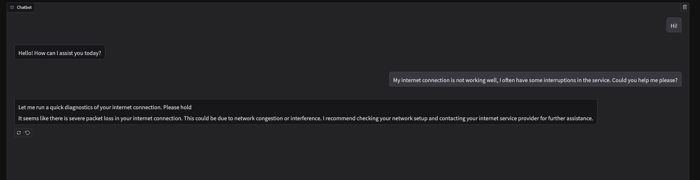

# Cynthia - AI Chatbot POC

Cynthia is a Proof of Concept (POC) agent that utilizes OpenAI's GPT with `tool_calls` to extend AI capabilities. This project explores how GPT can execute functions dynamically based on user interactions.

## Project Overview

Cynthia simulates a customer support agent for an internet service provider. When a user requests help, Cynthia "runs a diagnostic" to assess the internet connection status and provides a response. In this example, the diagnostic function is a mock that returns a randomly generated response mimicking a real network status check.

The project is built using **Python** and **Gradio** for the user interface.

## Installation & Setup

Follow these steps to run the project:

### 1. Create a virtual environment
```bash
python3 -m venv venv
cd venv
source venv/bin/activate
```

### 2. Install dependencies
```bash
pip3 install -r requirements.txt
```

### 3. Set up environment variables
Create a `.env` file in the project root with the following content:
```env
OPENAI_KEY=your-api-key
```

## Project Structure

- **`main.py`** → Contains the main logic and executes the project.
- **`ui.py`** → Configures the Gradio-based user interface.
- **`utils.py`** → Implements the function that simulates an internet service diagnostic.
- **`network_issues.json`** → Stores mock data for internet service issues.
- **`Integrations/openai`** → Handles the connection logic to OpenAI's API.

## Running the Project
Once setup is complete, run:
```bash
python main.py
```
This will start the chatbot interface via Gradio.

## Preview


## Considerations
This project is a proof of concept and **not** an example of best practices in coding structure or organization. The primary goal was to experiment with function execution via `tool_calls` and explore how they can extend AI functionality. There is significant room for improvement in terms of code quality and architecture.

## License
This project is licensed under the GPL-3.0 License.
